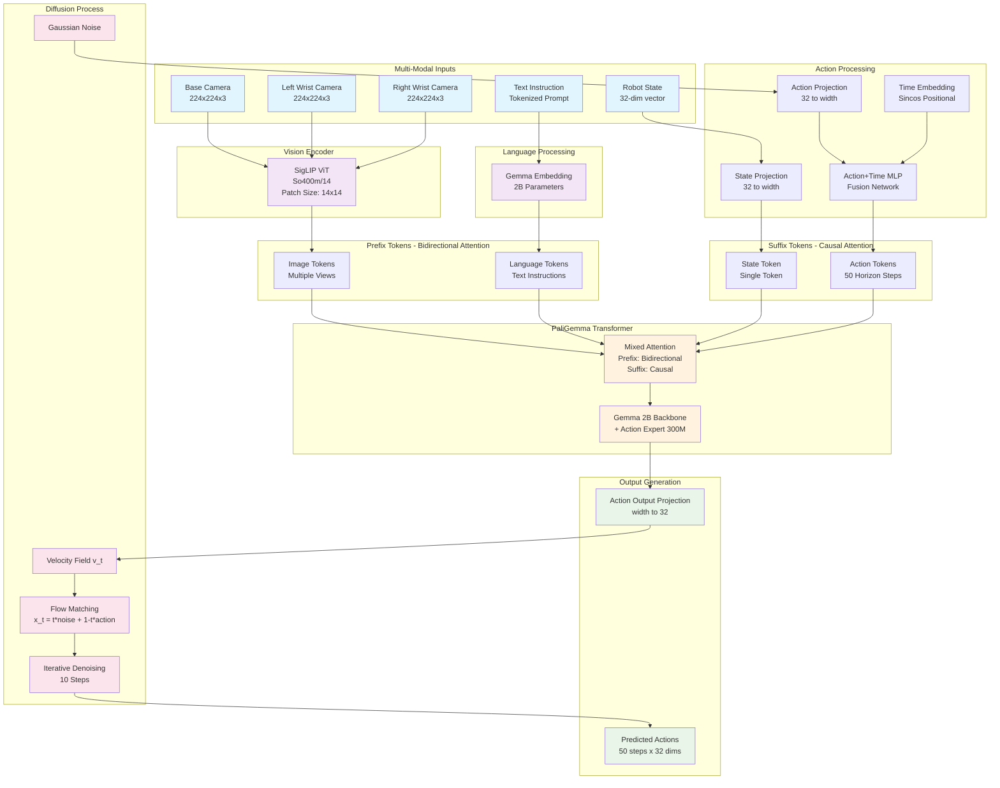

```mermaid
graph TB
    %% 输入层
    subgraph INPUT["Multi-Modal Inputs"]
        IMG1[Base Camera<br/>224x224x3]
        IMG2[Left Wrist Camera<br/>224x224x3]
        IMG3[Right Wrist Camera<br/>224x224x3]
        STATE[Robot State<br/>32-dim vector]
        TEXT[Text Instruction<br/>Tokenized Prompt]
    end

    %% 视觉编码
    subgraph VISION["Vision Encoder"]
        SIGLIP[SigLIP ViT<br/>So400m/14<br/>Patch Size: 14x14]
    end

    %% 语言编码
    subgraph LANGUAGE["Language Processing"]
        GEMMA_EMBED[Gemma Embedding<br/>2B Parameters]
    end

    %% Prefix Token处理
    subgraph PREFIX["Prefix Tokens - Bidirectional Attention"]
        IMG_TOKENS[Image Tokens<br/>Multiple Views]
        LANG_TOKENS[Language Tokens<br/>Text Instructions]
    end

    %% 动作处理网络
    subgraph ACTION_PROC["Action Processing"]
        STATE_PROJ[State Projection<br/>32 to width]
        ACTION_PROJ[Action Projection<br/>32 to width]
        TIME_EMB[Time Embedding<br/>Sincos Positional]
        ACTION_TIME_MLP[Action+Time MLP<br/>Fusion Network]
    end

    %% Suffix Token处理
    subgraph SUFFIX["Suffix Tokens - Causal Attention"]
        STATE_TOKEN[State Token<br/>Single Token]
        ACTION_TOKENS[Action Tokens<br/>50 Horizon Steps]
    end

    %% 主要Transformer
    subgraph TRANSFORMER["PaliGemma Transformer"]
        ATTENTION[Mixed Attention<br/>Prefix: Bidirectional<br/>Suffix: Causal]
        LLM_BACKBONE[Gemma 2B Backbone<br/>+ Action Expert 300M]
    end

    %% 输出层
    subgraph OUTPUT["Output Generation"]
        ACTION_OUT[Action Output Projection<br/>width to 32]
        FINAL_ACTIONS[Predicted Actions<br/>50 steps x 32 dims]
    end

    %% 扩散机制
    subgraph DIFFUSION["Diffusion Process"]
        NOISE[Gaussian Noise]
        FLOW_MATCH[Flow Matching<br/>x_t = t*noise + 1-t*action]
        VELOCITY[Velocity Field v_t]
        DENOISE[Iterative Denoising<br/>10 Steps]
    end

    %% 连接关系
    IMG1 --> SIGLIP
    IMG2 --> SIGLIP
    IMG3 --> SIGLIP
    TEXT --> GEMMA_EMBED
    
    SIGLIP --> IMG_TOKENS
    GEMMA_EMBED --> LANG_TOKENS
    
    IMG_TOKENS --> ATTENTION
    LANG_TOKENS --> ATTENTION
    
    STATE --> STATE_PROJ
    STATE_PROJ --> STATE_TOKEN
    STATE_TOKEN --> ATTENTION
    
    NOISE --> ACTION_PROJ
    ACTION_PROJ --> ACTION_TIME_MLP
    TIME_EMB --> ACTION_TIME_MLP
    ACTION_TIME_MLP --> ACTION_TOKENS
    ACTION_TOKENS --> ATTENTION
    
    ATTENTION --> LLM_BACKBONE
    LLM_BACKBONE --> ACTION_OUT
    ACTION_OUT --> VELOCITY
    
    VELOCITY --> FLOW_MATCH
    FLOW_MATCH --> DENOISE
    DENOISE --> FINAL_ACTIONS

    %% 样式定义
    classDef input fill:#e1f5fe
    classDef encoder fill:#f3e5f5
    classDef transformer fill:#fff3e0
    classDef output fill:#e8f5e8
    classDef diffusion fill:#fce4ec

    class IMG1,IMG2,IMG3,STATE,TEXT input
    class SIGLIP,GEMMA_EMBED encoder
    class ATTENTION,LLM_BACKBONE transformer
    class ACTION_OUT,FINAL_ACTIONS output
    class NOISE,FLOW_MATCH,VELOCITY,DENOISE diffusion
```